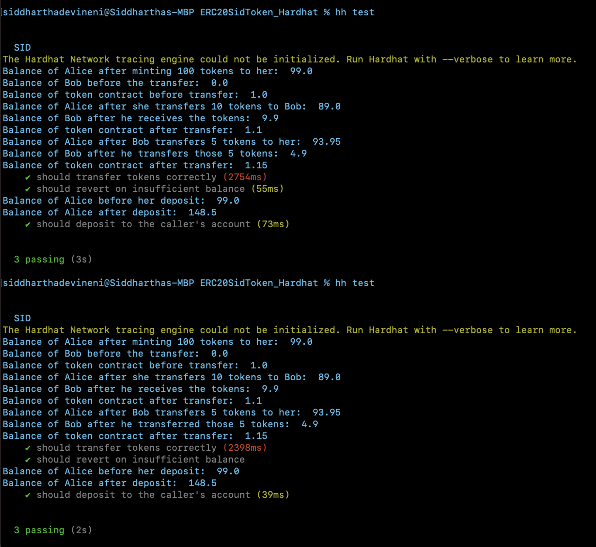

# SID token is an ERC20 standard token

This project demonstrates an implementation, deployment and testing of a token named Sid which is a standard ERC20 token. Deployment and testing are done in typescript using Hardhat toolkit.

Note: Please add your **_SEPOLIA_RPC_URL_**, **_PRIVATE_KEY_** and **_ETHERSCAN_API_KEY_** in the _env.template_ file to deploy your contract on sepolia test network and verify it on etherscan api.

### Unit tests

The below screenshot shows the unit tests done using hardhat and logging the different stages of transfer and deposit functions in the contract.
It also shows the tests performance optimization using **_loadFixtures_** of hardhat library from 3s to 2s.

